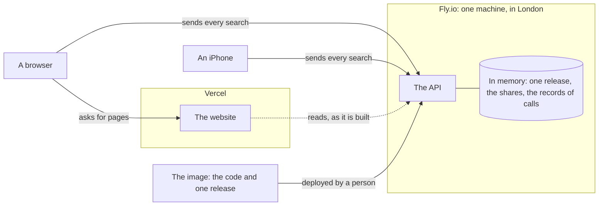
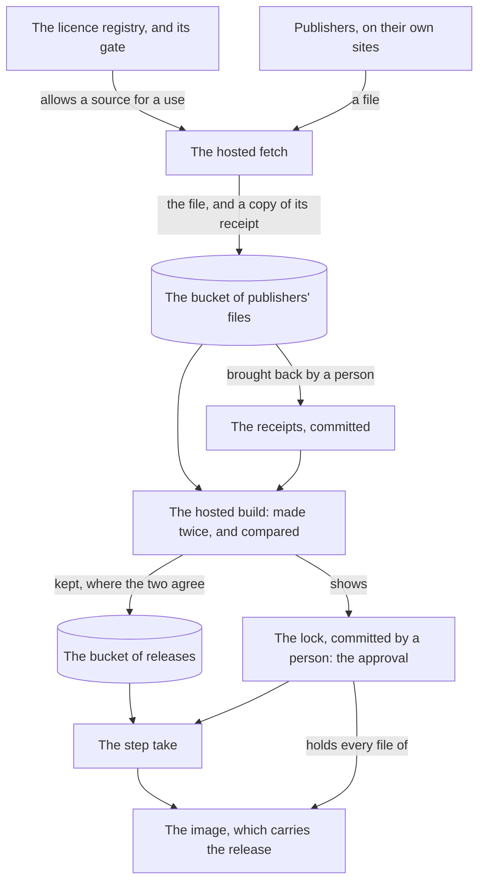
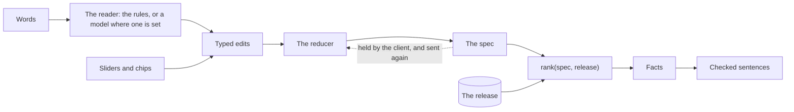
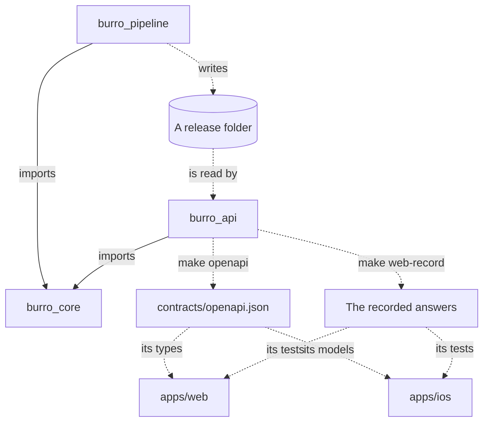

# The whole of Burro, in four pictures

What runs where, how data becomes a release, how a search is answered, and what may import what. Then the promises with what holds each, and the keys by what each may do.

GitHub draws each picture from the text of this page. Under each is the same thing in a table, for a reader whose tool draws none. [Where to look](README.md) leads to every other guide.

## 1. What runs where

| Part | Where | What it holds | What it reaches |
|---|---|---|---|
| The website, `apps/web` | Vercel | Pages and scripts. It has no route handler, no server action and no middleware, so nothing a person types passes through it | The API, as it is built and then hourly at most: routes 4, 5, 6 and 11 |
| The API, `services/api` | Fly.io, one machine, in London | In memory: one release, checked against its manifest before anything is served, the shares, and the records of calls, which hold no text. No database | **Nothing. It reaches no bucket, holds no key and needs no network to start.** The release is inside the image. The one key it will ever hold is the model's, and none is set |
| A browser | A person's own | The spec, and the words in the box | The website for pages, and the API for every search. The page's policy names those two origins and no other |
| The iPhone app, `apps/ios` | A person's own | The spec, and a shortlist kept on the phone | The API. The app has not been run yet |

A share is kept in the machine's memory, so there is one machine and no more, and a deploy forgets every link. [Putting Burro on the internet](../deploy/README.md) has the steps, and says what was tried on 25 September 2026 and what was not.

## 2. How data becomes a release

| Step | Who starts it | It reads | It leaves |
|---|---|---|---|
| Register | A person | The publisher's own licence page | An entry under `registry/sources/`. The gate refuses a source for any use its entry does not allow |
| Fetch | A person, who approves the run `data-fetch` | A file, from an address its entry names | The file in the bucket of publishers' files, by its hash, and a receipt: its address, its hash and its dates, and no row of it |
| Bring the receipts back | A person | The copies in the bucket | `data/receipts/`, committed |
| Build | A person, who approves each of the two builds of the run `data-london` | The bucket, with a key that can only read, and the receipts that are committed | A release on each of two runners. The second is held to the first, byte for byte |
| Keep | The second build, in one step | | The release, in the bucket of releases, and its lock on the page of the run. Nothing is kept where the two builds differ |
| Approve | The founder | The lock | The lock, committed under `data/approved/`. **To commit it is to approve the release.** No run can |
| Take | A person, before a deploy | The bucket of releases, and the committed lock | The release in a folder git ignores, each file held to the lock |
| Carry | The host's builder, at `fly deploy` | That folder, and the committed lock | An image that holds every file to the lock again. With no release named it carries the made-up city |

| To | Read |
|---|---|
| Do this for London again, from what is due to what is served | [Refreshing London](refreshing-london.md) |
| Know what a second city would take | [Adding a city](adding-a-city.md) |
| Set up the buckets, the keys and the environments, and read what a run prints | [Data builds](data-builds.md) |
| Know why a release is approved by its lock and carried in the image | [ADR 0030](adr/0030-a-release-is-kept-approved-by-its-lock-and-carried-in-the-image.md) |

## 3. How a search is answered

It is the sketch of [AGENTS.md](../AGENTS.md), which calls the reader the interpreter.

| What | Where it is so |
|---|---|
| **The client holds the spec.** It sends the spec with each edit, and takes back the spec the reducer leaves | Routes 1 and 2 of [the contract](design/contract.md#9-the-api) |
| **The server keeps nothing for a search.** There is no search id. A share is the only stored spec, and a person makes one on purpose | [ADR 0011](adr/0011-nothing-is-kept-for-a-search.md) |
| **The model never ranks.** A model stands in one box, the reader, and only where one is turned on. What it reads is offered and never applied. From the typed edits on, everything is code | [ADR 0002](adr/0002-deterministic-core.md), [ADR 0012](adr/0012-a-closed-vocabulary-and-a-guard-on-the-model.md) |
| With no model, or one that is slow, capped or broken, the rules read, and every route works | [ADR 0019](adr/0019-no-one-provider-and-a-key-alone-turns-nothing-on.md) |
| No more than 30 calls a minute and 2,000 a day reach a model, unless it is set otherwise, whoever asks. Over the cap the rules read | [ADR 0032](adr/0032-calls-to-a-model-are-capped-for-the-whole-service.md) |
| A sentence is shown only once the verifier has held every number and every name in it to the fact it cites | [The contract](design/contract.md#7-facts-explanations-and-the-verifier) |

## 4. What may import what

| Rule | What holds it |
|---|---|
| The pipeline and the API both rest on core, and never on each other. They meet at the release folder, and `open_served` in core is the only judge of one | [test_app.py](../services/api/tests/test_app.py) reads every import of the service, and [test_only_fetch_reaches_a_network.py](../packages/pipeline/tests/fetch/test_only_fetch_reaches_a_network.py) every import of the pipeline. The image installs core and the API alone |
| Core does no IO, and depends on one package | [test_purity.py](../packages/core/tests/test_purity.py) |
| The clients are generated from the contract, and their tests run on answers recorded from the API | A test fails where `contracts/openapi.json` is stale. `make web-check` and `make -C apps/ios check` fail where what is generated is |

## The promises, and what holds each

The thirteen rules of [AGENTS.md](../AGENTS.md), in its order. `make ci` runs every test named here but the website's, which `make web-check` runs.

| # | The promise, in short | What holds it | What nothing holds |
|---|---|---|---|
| 1 | No dataset is read or shipped unless the registry allows that use | The gate, in [test_registry_gate.py](../packages/pipeline/tests/test_registry_gate.py). A fetch asks it before it asks a publisher: [test_fetch_run.py](../packages/pipeline/tests/fetch/test_fetch_run.py). No other step can reach a network: [test_only_fetch_reaches_a_network.py](../packages/pipeline/tests/fetch/test_only_fetch_reaches_a_network.py). `burro-release check` asks the gate again about every file a figure rests on | |
| 2 | No source is approved without a primary-source link | The rule `approved_is_proven`, in [test_registry_rules.py](../packages/pipeline/tests/test_registry_rules.py), and `make registry-check` on the real registry | That the link is the publisher's own page. A person reads it |
| 3 | OpenStreetMap is for the basemap and the routing network only | The registry refuses share-alike data for the gazetteer and for scoring: [test_registry_rules.py](../packages/pipeline/tests/test_registry_rules.py), and the gate in [test_registry_gate.py](../packages/pipeline/tests/test_registry_gate.py) | That a comparison changes no record. No comparison is built |
| 4 | A banned source is refused for every use | [test_registry_gate.py](../packages/pipeline/tests/test_registry_gate.py): a ban is refused for every use, and no second entry can stand in for it | |
| 5 | Ranking is a pure function, and the model never ranks | [test_purity.py](../packages/core/tests/test_purity.py) and [test_rank.py](../packages/core/tests/test_rank.py). What a model returns is held to the rules by [test_guard.py](../services/api/tests/test_guard.py) | |
| 6 | Every number and proper noun traces to a stored fact | The verifier: [test_verify.py](../packages/core/tests/test_verify.py). `burro-release check` names every fact with no evidence behind it. The website's own words hold no number and no name of a place: [site-copy.test.ts](../apps/web/test/site-copy.test.ts) | A sentence written by a model. None is shown: the verifier is not yet enough for one |
| 7 | Missing data is never filled in | [test_rank.py](../packages/core/tests/test_rank.py) and [test_facts.py](../packages/core/tests/test_facts.py): a time that is not known is none and never nought | |
| 8 | Rank places. Of residents, only age and households | The gate keeps every other table out of scoring: [test_registry_gate.py](../packages/pipeline/tests/test_registry_gate.py). Core names what counts residents, and reads no wish for fewer of anyone: [test_catalogue.py](../packages/core/tests/test_catalogue.py), [test_spec.py](../packages/core/tests/test_spec.py), [test_interpret.py](../packages/core/tests/test_interpret.py). The reader of the police's files opens the crime files and no other, so stop and search is never read: [test_street_crime_files.py](../packages/pipeline/tests/derive/test_street_crime_files.py) | That a neutral measure does not follow a protected group. The audit that would have looked was dropped: [ADR 0006](adr/0006-rank-places-not-residents.md) |
| 9 | What is typed is never logged or stored | [test_privacy.py](../services/api/tests/test_privacy.py) plants a marker and looks for it everywhere. No route takes text in an address: [test_contract.py](../services/api/tests/test_contract.py). The website: [apps/web/test/privacy](../apps/web/test/privacy/search.test.tsx) | The settings at each host. They are set by hand: [the guide to deployment](../deploy/README.md#privacy-settings-host-by-host) |
| 10 | No private hostname and no credentials in a tracked file | `make public-only`, which is [check_public_only.py](../tools/check_public_only.py): first in `make ci`, and a step of every data workflow. [test_published_words.py](../tools/tests/test_published_words.py) reads every document | |
| 11 | No secret in the repository | `.gitignore` keeps `.env` out. A key of a store is given to one step of one approved environment, and no log may show it: [check_data_workflows.py](../tools/check_data_workflows.py), [public_log.py](../tools/public_log.py), [canary.py](../tools/canary.py) | **Nothing scans the repository for a secret.** `make public-only` finds a URL with credentials, and says of itself that it is no secret scanner. That nobody reads a `.env` file is a rule for whoever works here, and no check holds it |
| 12 | A new dependency has a reason, and ships no binary it needs | A package is imported only once a person has added it to a list: [test_only_fetch_reaches_a_network.py](../packages/pipeline/tests/fetch/test_only_fetch_reaches_a_network.py), [test_purity.py](../packages/core/tests/test_purity.py), [test_app.py](../services/api/tests/test_app.py) | **The reason in the pull request, and that a package ships no binary.** Both are read by a person |
| 13 | Made-up data is unmistakably made up | No made-up name is a real one: [test_synthetic_release.py](../packages/pipeline/tests/test_synthetic_release.py). Every answer says `synthetic`, errors included: [test_routes.py](../services/api/tests/test_routes.py). No page of made-up data may be indexed: [indexing.test.tsx](../apps/web/test/indexing.test.tsx) | |

## The keys, by what each may do

No name and no value is written anywhere in the repository. [Data builds](data-builds.md) says how each is made, and how one is rotated.

| Key | It is for | Bucket | It may | Where it is kept |
|---|---|---|---|---|
| Fetch | Storing a publisher's file and the copy of its receipt | Publishers' files | Read and write | The environment `data-fetch`, on GitHub |
| Check | Saying whether the store holds every file that has a receipt | Publishers' files | Read | The environment `data-held` |
| Reading | Bringing the receipts back to be committed | Publishers' files | Read | The founder's password manager. Never on GitHub |
| Build | Copying files out of the store to build London | Publishers' files | Read | The environment `data-london` |
| Keep | Keeping a release that two builds agree on | Releases | Read and write | The environment `data-london`. One step is given it |
| Take | Taking an approved release before an image is built | Releases | Read | The founder's password manager. On no host |
| The model's, later | Reading what is typed, once a provider is turned on | None | | A secret of the API's machine, set from the keyboard. Not set today |

A key is held to a bucket and to nothing finer, which is why there are two buckets. Every job that is given a key waits for the founder's approval, on `main` alone. The environments `data-build` and `data-travel` hold made-up values and no key. No key deploys: the founder deploys signed in, and no workflow can.
