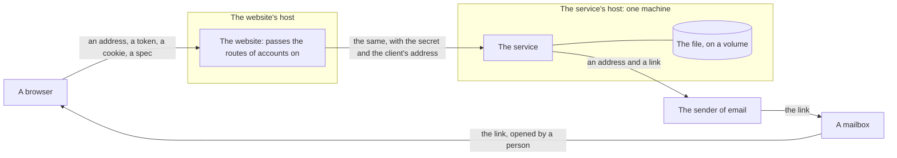

# Accounts: what could go wrong, and what holds it

Status: written on 2026-09-26, with [the design of accounts](accounts.md), for whoever changes accounts and for the founder. It asks of each way in what somebody who means harm would try, what the design does about it, which test holds that, and what is left that nothing holds. **What was built was tried once, on 2026-09-26, on a copy on one machine: on no host, and by nobody whose work is security.** Four things did not hold. Each was mended, with a test that failed before it was, and ways 17, 28, 33, 44 and 58 say which. **It was read and tried again on 2026-09-27**, on one machine as before, and ways 28, 59, 60 and 61 say what was mended then, and way 30 what was found and left. One thing was found that no page can mend, and way 6 says it. **Nobody has attacked the service where it is hosted.** No person whose work is security has read this page, the design or the code, and there is no budget for it ([ADR 0007](../adr/0007-no-solicitor.md) says the same of the law). Accounts are off until they are turned on ([ADR 0043](../adr/0043-burro-has-accounts-and-a-person-signs-in-by-a-link-sent-by-email.md)), and nothing of them has run on a host.

A way in has a number, and keeps it: a test, a record or a change may name it. Add to the end of a table, and do not number again.

| Word | Meaning |
|---|---|
| Route N | The route with that number in [the design of accounts](accounts.md), section 6 |
| The website | `apps/web`, and the company that serves it |
| The service | `services/api`, and the company that runs it |
| The file | The database of [ADR 0045](../adr/0045-the-service-has-a-database-one-file-for-accounts-and-what-they-keep.md) |
| Held by | The test that fails if the rule is broken. "No test" says that the code does it and nothing would notice if it stopped |
| What is left | What the design does not stop. It is not a list of faults to mend: much of it cannot be mended, and is here so that nobody takes it to be held |

## 1. What there is to take

| What | Why somebody would want it | Where it is |
|---|---|---|
| **A person's searches** | A spec says where a person must get to each day: where they work, where their child goes to school, a hospital, a place of worship. It says what they can pay. Under an account it says so of a person who can be named. Whoever looks for a person wants this, and so does whoever would sell to them | The file. The answers of routes 22 to 27 and 31, which pass through the website |
| **The list of who has an account** | It is a list of people who are thinking of moving, with an address to write to | The file. The records of the sender of email, which hold every address that asked, account or none |
| **The sending of mail** | To fill somebody's mailbox. To spend Burro's allowance with the sender. To have Burro's domain taken for a sender of spam, so that nobody's link arrives | Route 15 |
| **The service** | To stop it, for everybody, searching among it | One machine, one file, one writer |
| **A session** | It is the account, for as long as it lasts | A cookie in a browser. Its hash in the file |
| **The secrets** | Each opens something: the routes of accounts to a caller that is not the website, the sending of mail in Burro's name | The environment of the service and of the website, at their hosts |

## 2. Who might try

| Who | What they hold already | What they want |
|---|---|---|
| Anybody on the internet | The address of the website and of the service, which are public, and any number of clients | The sending of mail, the service stopped, the list of who has an account |
| Somebody who knows the person: a partner they have left, a housemate, an employer, a landlord | Their address of email. Perhaps their computer for an hour, or their mailbox | Where they are going |
| Somebody who sends a link | An account of their own, and a story | That the person keeps their searches where the sender can read them |
| A page of another site that the person opens | The person's browser, with its cookies | To act as them |
| A program that guards a mailbox | Every link in every mail, which it opens | Nothing. It harms by accident |
| Whoever can read a mail: the sender of email, the company that holds the mailbox | The link, for the 15 minutes that it works | The account |
| The hosts, their staff, and whoever takes the founder's sign-in at a host | Everything that passes, the file and the secrets | Any of it |
| Whoever holds a copy of the file, or of a snapshot of its volume | The file as it was that day | The searches and the list |
| A later owner of a mailbox | An address that was somebody else's | Nothing, until a link arrives |
| Somebody who writes to the founder as if they were the person | An address to write from | A copy of everything, or the account deleted |

## 3. What passes where

| Line | What crosses it | Who can read it there |
|---|---|---|
| The browser to the website | The address a person types, the token of a link, the two cookies, the spec of a search that is kept, the ids of searches and of sessions. All in bodies and headers, none in an address | The website's host, which ends the connection |
| The website to the service | The same, with the secret of the website and the address of the client | The service's host |
| The service to the sender of email | The address a link is for, and the mail, which holds the link | The sender, and whatever it keeps of a mail |
| The sender to the mailbox | The mail | The company that holds the mailbox, and whatever reads mail on its way |
| The mailbox to the browser | The link. What follows its `#` is sent to no server | The person, and any program that opens their mail |

What a person types into the search box crosses none of these lines. The browser sends it to the service itself, as before, and an account changes nothing of it.

## 4. The ways in

### 4.1 The link, and the token in it

| # | The way in | What the design does | Held by | What is left |
|---|---|---|---|---|
| 1 | **A link sent by another.** Somebody asks for a link to their own address and sends it on, with a story: "here are the areas I found for you." If opening it signed a person in, they would be in the sender's account, and whatever they kept there would be the sender's to read | The page a link opens signs nobody in. It asks the service whose link it is, and says so: "Sign in as name@example.org". The link was not asked for in this browser, so the page says that too, shows the address again, and asks a second time. Only then does a press send the token. Once signed in, the page of the account says whose it is | `test_a_link_that_somebody_else_sent_signs_nobody_in_unseen`, `test_a_link_opened_in_another_browser_is_not_taken_without_being_asked`. Of the page: `test_the_page_says_whose_link_it_is_and_signs_nobody_in_until_the_button_is_pressed`, `test_a_press_sends_nothing_and_the_page_shows_the_address_again_and_asks_a_second_time`, `test_only_once_the_second_asking_is_answered_is_the_token_sent_with_that_the_person_was_asked` | **A person who presses twice, past an address that is not theirs.** Nothing holds that but the words on the page. [ADR 0043](../adr/0043-burro-has-accounts-and-a-person-signs-in-by-a-link-sent-by-email.md) says what changes if it happens once: a link that is opened in another browser is refused |
| 2 | **A link opened by a program in a mailbox.** Such a program opens links to see what is behind them, and some run the scripts of the page | To open the page uses nothing up. The token stands after the `#`, so the website is sent none. The page asks route 16, which uses nothing up. Only a press sends the token, and a `GET` changes nothing | `test_a_get_uses_no_token_up`, `test_a_page_is_told_whose_link_it_is_and_asking_uses_nothing_up`. Of the page: `test_nothing_but_a_press_sends_the_token_to_sign_in` | A program that presses what it finds. It would press in a browser that did not ask, so it would have to press twice. The link would then be used up, and the person would ask for another. The program's browser would hold a session that the person can see, and end, among where they are signed in |
| 3 | **A link asked for in somebody's name.** Anybody can type anybody's address | The person gets a mail that they did not ask for, which says that nothing happens unless the link is used. If they use it they are signed in to their own account, in their own browser. **The session is given to the browser that presses, and never to the one that asked**, so whoever asked gains nothing. The limits of 4.6 hold how many such mails there can be | `test_signing_in_gives_the_session_and_takes_back_what_bound_the_link`, `test_a_link_opened_in_another_browser_is_not_taken_without_being_asked` | The mail itself, ten a day at the most. Nothing says who asked: the address of a client is kept nowhere |
| 4 | **A token that is guessed** | It is 32 bytes from the system's source of randomness: one of 2 to the power of 256. Routes 16 and 17 are limited for each client. There is no count of wrong tries for an address, so nobody can be locked out by somebody else's guesses | `test_a_token_is_32_bytes_from_the_systems_own_source`, `test_no_two_tokens_are_the_same_and_each_is_in_the_shape_of_one`, `test_a_client_may_show_so_many_links_in_a_quarter_of_an_hour_and_no_more` | Nothing |
| 5 | **A token that is used twice**, or twice at once by two requests | That it has not ended and was not used is checked and marked in one transaction. The second request is answered `link_used`. Using a link ends every other that was asked for the same address | `test_a_link_works_once`, `test_of_two_that_use_one_link_at_once_one_signs_in`, `test_using_a_link_ends_every_other_that_was_asked_for_the_same_address` | Nothing |
| 6 | **A token that is found in a log, an address or a referrer** | What follows a `#` is sent to no server, so it is in no log of requests. The page takes it out of the address bar as soon as it has read it, and sends no referrer. It travels to the service in a body, and neither the website nor the service writes a body down. What the file holds is its SHA-256 | `test_what_is_kept_of_a_link_is_the_hash_of_its_token_and_never_the_token`, `test_no_line_holds_an_address_a_token_a_session_an_account_a_client_or_a_spec`. Of the page: `test_it_is_taken_out_of_the_address_bar_at_once_and_before_anything_is_asked`, `test_it_is_put_in_the_place_of_the_entry_that_held_it_and_no_entry_is_added`, `test_it_goes_to_the_service_in_the_body_of_a_request_and_in_no_address`, `test_it_is_nowhere_on_the_page_in_no_attribute_and_in_nothing_the_browser_keeps` | What a browser keeps of the pages it has opened is the browser's own, and may hold the address as it was first opened. **It does, in its record of how the page was loaded**: there a script of the page itself can read the whole address, the token with it, until the page is left. It was seen in a browser on 2026-09-26. No page can take it out, no other site can read it, and no server is sent it. The link is 15 minutes old at the most and works once |
| 7 | **A token that is read in the mail**: at the sender of email, at the company that holds the mailbox, or by whoever else reads a person's mail | It ends after 15 minutes and works once. It opens the account and nothing beyond it: there is no password to learn, and no way to change the address of an account | No test can hold it | **Whoever can read a person's mail can sign in as them.** It is so of every account anywhere that sends a way back in by mail. They would sign in from another browser, and be asked twice, which stops nobody who means to |
| 8 | **A sender of email that follows links.** Many senders can put an address of their own in the place of each link of a mail, to count who pressed. The sender would then hold every token in its records of what was pressed, for as long as it keeps them | The mail is plain text, with the link as it is. To one of the two senders that are fitted, each mail says of itself that no link of it is to be followed and that it is not to be counted when it is opened. With the other it is a setting of the domain, at the sender | `test_a_letter_is_not_followed_and_is_not_opened_for_the_sender`, for the one. For the other, no test: [the guide to deployment](../../deploy/README.md#turning-accounts-on) says to leave the setting off, and to read a mail that arrived | A setting that is changed at the sender, and no test fails |
| 9 | **A link that leads elsewhere.** If the address of the website in a link were taken from the request, somebody could ask for a link in a person's name with a header of their own. The mail would lead the person to another site with a good token after the `#`, which a page there can read | The address that a link leads to comes from a setting of the service, and never from a request | `test_asking_for_a_link_sends_one_to_the_address_made_regular` | Nothing |
| 10 | **Two mailboxes that are one account.** An address is made regular before it is looked up. If the mail went to the address as it was typed, and that were another mailbox than the one the account is named for, the owner of the one would sign in as the owner of the other | The mail is sent to the address as it was made regular, which is the address the account bears | `test_asking_for_a_link_sends_one_to_the_address_made_regular`, `test_a_full_stop_and_a_plus_are_part_of_an_address`, `test_an_address_that_is_not_in_plain_letters_is_refused_and_never_folded` | A company that holds two mailboxes apart which differ only by a capital. None is known of |
| 11 | **Words of somebody's own in a mail from Burro** | Nothing that was typed is in the mail but the address it is sent to. An address with a line break in it, or anything else that is no address, is refused before anything is sent | `test_the_letter_is_plain_text_and_the_same_for_everybody`, `test_what_is_not_in_the_shape_of_an_address_is_no_address` | Nothing |
| 12 | **What development allows, on a host.** In development a link is written to the console, the website may be in the clear, and the two cookies bear plain names and are not `Secure` | The service does not start in development unless it listens to its own machine alone. A website in the clear is refused unless the service is in development and the website is on that machine too | `test_the_service_is_in_development_only_where_it_listens_to_this_machine_alone`, `test_a_link_is_never_to_a_website_in_the_clear_but_in_development`, `test_the_sender_for_development_is_refused_where_the_service_is_not_in_development` | Nothing on a host. On a machine of one's own, whoever reads the terminal reads the link |
| 56 | **A person is talked into handing their link over.** Somebody asks for a link in the person's name, from a browser of their own, and then asks the person for it: by a page that looks like Burro's, or by a message that says it is needed to mend their account | The mail says that the link is to be passed on to nobody, and that Burro shows whose link it is before it signs anybody in. A link ends after 15 minutes and works once | No test can hold it | **Whoever is handed a link while it works signs in as the person, in the browser that asked for it, and is asked once and not twice.** A code that is typed by hand can be given away in the same manner. What would hold it is a second thing that the person holds, such as a passkey, which is not built |

### 4.2 A session

| # | The way in | What the design does | Held by | What is left |
|---|---|---|---|---|
| 13 | **A session read by a script**, which a fault in a page had let in | The cookie is `HttpOnly`: no script can read it. The website keeps nothing in the storage of the browser | `test_signing_in_gives_the_session_and_takes_back_what_bound_the_link`, `test_a_cookie_the_service_sets_is_let_by_where_it_is_one_of_the_two_and_is_set_as_it_must_be` | **A script that is let in can ask as the person, though it cannot read the cookie.** The website's policy allows a script that is written into a page, because the framework writes some, so a fault that lets markup in lets a script in. What stands against it is that the website writes nothing into a page that a person typed, and draws what the service sent as text |
| 14 | **A session read on its way** | The cookie is `Secure`, and both hosts are reached over TLS alone. The service opens no port that answers in the clear, and the website passes nothing on to a service whose address does not begin `https://`, but on a machine of one's own | `test_signing_in_gives_the_session_and_takes_back_what_bound_the_link`, `test_a_cookie_the_service_sets_is_let_by_where_it_is_one_of_the_two_and_is_set_as_it_must_be`, `test_a_service_that_is_reached_in_the_clear_%s_is_passed_nothing`. [The guide to deployment](../../deploy/README.md) | Whether the website's host tells a browser never to ask in the clear was not read ([the guide](../../deploy/web/README.md)). A proxy in front of either host would read every session: the guide forbids one |
| 15 | **A session read in the file, or in a log** | The file holds the SHA-256 of a session and never the session. No line of a log holds a cookie, a header or a session | `test_signing_in_gives_the_session_and_takes_back_what_bound_the_link`, `test_the_hash_of_a_session_opens_nothing`. `test_no_line_holds_an_address_a_token_a_session_an_account_a_client_or_a_spec`, `test_the_log_gained_two_fields_and_each_is_a_word_of_a_closed_list` | Nothing |
| 16 | **A session that is set from outside.** Somebody gets a cookie of their own choosing into a person's browser, from a page of a host beside the website's or over a connection in the clear, so that the person is signed in to a session the other holds | A new session is always made when a person signs in, and none is ever taken from the client. The name of the cookie begins `__Host-`, which a browser takes only from the host itself, over TLS, for the whole of the host and no wider. The service takes a session from the cookie alone: never from a body or an address | `test_a_session_is_never_taken_from_the_client`, `test_signing_in_again_makes_a_new_session_and_revokes_the_one_the_browser_had`, `test_out_of_development_a_cookie_under_a_plain_name_opens_nothing`. `test_signing_in_gives_the_session_and_takes_back_what_bound_the_link`, `test_a_cookie_the_service_sets_is_let_by_where_it_is_one_of_the_two_and_is_set_as_it_must_be` | Nothing |
| 17 | **A browser that was left signed in**, at work, in a library, or at home where somebody else uses it | A session ends after 30 days unused, and never lasts past 90. A person can sign out, which revokes the session at the service, and can see where they are signed in and end each, or all. The account cannot be deleted from a session that is older than ten minutes. Where somebody is signed in, a tab asks the service who is as they come back to it, so that signing out elsewhere, or everywhere, is seen in a tab that was left open. What a person who has signed out is still shown by a page that the browser kept is way 58, and what the tab still holds of their search is way 59 | `test_a_session_lasts_thirty_days`, `test_a_session_never_lasts_past_ninety_days_from_when_it_was_made`. `test_signing_out_revokes_the_session_at_the_service`, `test_signing_out_everywhere_revokes_every_session_of_the_account_and_no_other`. `test_somebody_who_is_signed_in_is_asked_about_again_as_they_come_back_to_the_tab` | **For as long as a browser is signed in, whoever sits at it sees what was kept: where the person must get to, and where they hope to live.** To a person who is leaving somebody, that is the harm that matters most. Nothing holds it but the person's own care. The privacy notice says to sign out of a computer that is shared. **The website says nothing of it where a person signs in**, and whether it should is the founder's to decide |
| 18 | **A session that is used after the person signed out, or after the account was deleted** | To sign out is to revoke the session at the service, and not only to forget the cookie. An account goes with every session of it, in one transaction | `test_signing_out_revokes_the_session_at_the_service`, `test_signing_out_everywhere_revokes_every_session_of_the_account_and_no_other`. `test_an_account_is_deleted_with_everything_of_it_in_the_file_and_beside_it`, `test_what_is_deleted_is_gone_from_the_file_and_not_only_from_the_tables` | Nothing |
| 58 | **A page that the browser kept, shown again after the person signed out.** A browser keeps a page that a person has left, as it stood, and shows it again when somebody presses Back. It asks the service nothing as it does | As a page is put away it lets go of who is signed in, of the address a link was asked for, of the token of a link, and of everything of an account that it has drawn. When it is shown again it begins again, and asks the service. *As it was first built a person signed out, somebody pressed Back, and the page of their account was shown as it had stood, with their address and the searches they had kept: it is the person who did the right thing on a shared computer who was shown* | `test_nothing_of_the_account_is_drawn_or_held_once_the_page_is_put_away`, `test_a_person_who_signed_out_meanwhile_is_not_shown_to_whoever_presses_back`, `test_the_page_a_link_opens_lets_go_of_the_link_and_of_whose_it_is`, `test_the_page_that_says_a_link_was_sent_lets_go_of_the_address_that_was_typed`, `test_the_page_of_signing_in_does_not_say_who_was_signed_in_before_it_has_asked_again` | What a person can read of a screen that was left in sight, before the page is put away. Whether every browser tells a page that it is being put away was tried in one, Chrome. Whoever presses Back to the page a link opened must open the link from the mail once more |
| 59 | **The search of a person who has signed out, left in the tab.** The search of a tab is held in memory for as long as the tab is open, and the page that says a person has signed out, or that their account is deleted, leads to the search page. Whoever sits down next would read where the person must get to. Where they then signed in, and let Burro keep their last searches, the search before them would be sent to be kept in their account | As a person signs out of the browser they are using, signs out everywhere or deletes their account, on the page of their account, the search of the tab is begun again, and the areas that were chosen from it and the link that was made of it go with it. It is done once the service has answered, so a sign-out that failed leaves the search as it was. *As it was first built the search stayed: after each of the three, "Go to the search" showed the place a journey led to, the budget and the results, and the search was kept among the last searches of the next person to sign in in that tab* | `test_signing_out_of_this_browser_leaves_no_search_in_the_tab`, `test_signing_out_everywhere_leaves_no_search_in_the_tab`, `test_deleting_the_account_leaves_no_search_in_the_tab`, `test_a_sign_out_that_failed_leaves_the_search_of_the_tab_as_it_was` | **A search in another tab of the same browser stays** until that tab is closed or loaded again. So does the search of a tab whose session ended, or was ended from elsewhere. Whether either should go is the founder's to weigh: a search that goes from under a person who is reading it costs something too |
| 60 | **A page that names one person, while another is signed in.** Two people use one browser. The page of an account was opened for the first in one tab, and in another tab the first signed out and the second signed in. The first tab would go on naming the first person and listing their searches, and whatever was pressed on it would be done to the account of the second: a copy would be the second's, and "Delete my account" would delete the second's account | Whose account a request is about is decided by the session, at the service, so nothing of the first person's is given to anybody or changed. The page hears who is signed in whenever the service is asked, as it is when a tab is come back to. Where that is somebody else than the page was opened for, the page begins again: it asks whose account it is and draws that, and whatever it had drawn goes, the question that deletes at one press among it. *As it was first built the page heeded such an answer only where it said that nobody was signed in: it named the first person, and deleted the account of the second* | `test_a_page_opened_for_one_person_begins_again_once_the_service_says_that_another_is_signed_in`, `test_somebody_who_is_signed_in_is_asked_about_again_as_they_come_back_to_the_tab` | **A press that is made before the page has been told goes to the account of the other still.** That is the moment between a tab being shown and the service answering, and deleting takes two presses. What would hold it is a request that names the address the page showed, which the service refuses where the session is somebody else's: a change to the contract, which is not built |
| 61 | **The search of one person, kept in the account of another.** The search of a tab stands until the tab is closed, while one person signs out and another signs in, in that tab or in another of the browser. Where the second lets Burro keep their last searches, what stands would be sent to be kept for them, and where the first must get to would be held in the account of the second | A search is sent to be kept among the last ones only for the person who was signed in as it was made. The website holds, beside the ranking that stands, that somebody was signed in as the search page first saw it and that nobody has taken their place since, and nothing of who they are. What somebody else made, and what anybody made who was not signed in, is sent by nothing but a press. *As it stood on 2026-09-27, once whether the last searches are kept was asked again of each person, the search of one person was kept in the account of another, who had made no search and pressed nothing: seen in a browser, in two tabs* | `test_a_search_that_stands_as_another_person_signs_in_is_not_sent_to_be_kept_for_them`, `test_a_search_that_was_made_while_nobody_was_signed_in_is_not_sent_to_be_kept_for_whoever_signs_in_next`, `test_whose_a_search_is_is_held_while_the_search_page_is_left_and_come_back_to`, `test_the_search_that_stands_is_not_theirs_who_signs_in_after_it_was_made` | **Whoever is signed in can save what stands on the page by a press, whoever made it**: they can read it there, which is way 59. A search that the second person makes in that tab is made of the one that stands, so what is kept of theirs may hold a place that the first named. The service keeps what it is sent for whoever the session says, and cannot tell whose a search was. A person who made a search before they signed in does not find it among their last searches, and can save it by a press |

### 4.3 A request made from another site

| # | The way in | What the design does | Held by | What is left |
|---|---|---|---|---|
| 19 | **A form or a script on another site asks a route that changes something**, and the browser sends the cookie with it | The cookie is `SameSite=Lax`, so a browser does not send it with such a request. And every request that changes anything needs three things: an `Origin` that is on the list, exactly, `Content-Type: application/json`, and the header `X-Burro-Request: 1`. A form can send none of the last two, and a script of another site may send them only if it is let, which it never is. The website refuses such a request before it is passed on, and the service refuses it again | `test_what_changes_anything_comes_from_a_page_of_the_website`, `test_what_changes_anything_says_that_a_page_of_burro_asked`, `test_what_changes_anything_is_sent_as_json_and_as_nothing_a_form_can_send`, `test_asking_for_a_link_needs_all_three_though_there_is_no_cookie_yet` | A browser so old that it knows neither `SameSite` nor what a page may send across origins. None that runs the website is known to be |
| 20 | **A page of another site signs a person in**, to an account of the page's own, by sending its token to route 17. There is no cookie yet, so `SameSite` does nothing | Signing in is a request that changes something, and needs the same three things | `test_what_changes_anything_comes_from_a_page_of_the_website`, `test_what_changes_anything_says_that_a_page_of_burro_asked`, `test_what_changes_anything_is_sent_as_json_and_as_nothing_a_form_can_send`, `test_asking_for_a_link_needs_all_three_though_there_is_no_cookie_yet` | Nothing |
| 21 | **A page of another site reads an answer** | The routes of accounts are asked of the website's own origin, so to a browser they are the website's. The list of origins is exact, and no answer ever allows a cookie across origins. Every answer of these routes is `no-store` and `nosniff` | `test_no_browser_is_let_send_a_cookie_or_the_header_of_a_page_across_origins`. `test_every_answer_is_never_kept_and_is_what_it_says_it_is`, `test_every_answer_of_the_route_says_that_no_browser_may_keep_it` | Nothing |
| 22 | **A link on another site leads to a route**, and the browser follows it with the cookie, as `Lax` lets it for a `GET` | A `GET` changes nothing, ever. What it answers, the other site cannot read | `test_a_get_needs_the_website_and_no_more_and_changes_nothing` | Nothing |
| 23 | **The website drawn inside a page of another site**, with something over it, so that a person presses "Sign in" or "Delete" without knowing | The website's policy lets no other site draw it in a frame | The tests of the website's headers | Nothing |

### 4.4 Whose rows are read

| # | The way in | What the design does | Held by | What is left |
|---|---|---|---|---|
| 24 | **An id that is guessed**, or that was seen somewhere: of a search, of a session | An id is 128 random bits. Whose rows are read is decided by the session, at the service, and every look-up names the account. An id of somebody else's is answered as an id of nobody's | `test_no_route_ever_returns_a_row_of_another_account`, `test_an_id_that_is_guessed_or_is_somebody_elses_gives_nothing`, `test_whose_rows_are_read_is_never_decided_by_what_a_request_says` | Nothing |
| 25 | **An account that is named in a request** | No route takes the id of an account, or an address, but the route that sends a link. Nothing a request says decides whose rows are read | `test_no_route_ever_returns_a_row_of_another_account`, `test_an_id_that_is_guessed_or_is_somebody_elses_gives_nothing`, `test_whose_rows_are_read_is_never_decided_by_what_a_request_says` | Nothing |
| 26 | **A spec that is made to break what reads it later**: a statement of the database, a page that draws it, a program that reads the copy | Every statement binds its values, and none is made of strings. A spec is checked by the schema that the ranking uses before it is kept and again when it is read, and holds no text of a person's: its every field is a number, a word of a closed list or an id of the release. The name of a search is worked out by code | `test_no_statement_is_ever_made_by_putting_strings_together`, `test_every_statement_that_takes_a_value_binds_it`, `test_one_layer_is_the_only_code_that_touches_the_connection`. `test_a_search_is_checked_by_the_schema_the_ranking_uses_before_it_is_kept`, `test_a_search_is_checked_again_when_it_is_read`, `test_what_is_kept_holds_no_word_that_anybody_typed` | Nothing |

### 4.5 Who has an account

| # | The way in | What the design does | Held by | What is left |
|---|---|---|---|---|
| 27 | **Asking for a link, to learn from the answer whether an address has an account** | The answer is always the same, 202 with the same body, and takes the same time. A link is sent whether or not there is an account, and the mail reads the same. An account is made at the first sign-in, and not when a link is asked for | `test_a_known_address_and_an_unknown_one_are_answered_the_same`, `test_a_known_address_and_an_unknown_one_are_given_the_same_work`, `test_a_known_address_and_an_unknown_one_are_answered_in_like_time` | **The sender of email holds every address that asked.** And whoever can read a person's mailbox sees that a mail from Burro arrived |
| 28 | **Asking often, to learn from a refusal that somebody else has asked for the same address** | What is refused out loud is the client that asks too often, and the whole service once it has sent what it may. A limit that is for an address is kept in silence: the answer is the 202 it would have been, and no mail is sent. **It is given as soon as any other, and costs the same work.** An email is sent once its answer has been given, so no answer waits on the company that sends. And what is written to the file for an address over its limit is what is written for any address, and is taken out again before it is kept. It leaves no row, and is counted in the hour all the same, so that a full hour does not say which it was. A mail that the company would not take is answered 202 as well, because what it would not take may be about the address. *As it was first built the email was sent before the answer, and an address over its limit, which is sent none, was answered sooner by as long as the company takes: whoever timed three answers could tell that somebody had asked for a link for that address in the last quarter of an hour, which is to say that its owner uses Burro* | `test_three_links_to_an_address_in_a_quarter_of_an_hour_and_no_more`, `test_a_letter_the_sender_will_not_take_is_answered_as_any_other`. `test_a_letter_is_sent_once_the_answer_has_been_given`, `test_an_address_over_its_limit_is_answered_as_soon_as_one_that_is_sent_a_letter`, `test_an_address_over_its_limit_is_given_the_same_work_as_any_other`, `test_what_is_written_for_an_address_over_its_limit_is_in_no_byte_that_is_left`, `test_an_address_over_its_limit_fills_the_hour_as_any_other` | An answer cannot say that its email failed. So where the company cannot be reached, one person a minute is told that a link is on its way, and it is not: their link is ended, and whoever asks in the minute after is answered 503, whatever their address (`test_a_sender_that_cannot_be_reached_is_said_to_whoever_asks_next`). **While the company cannot be used, that answer says whether the ask before it handed the company an email, and so whether its address was over its limit**: 503 where it was not, 202 where it was. By counting asks of their own, whoever wants to know can count those of somebody else for an address, within the day. What closes it is no minute at all, which is the founder's to choose: [the design](accounts.md), section 4, under "What the minute tells". The time of an answer was measured on one machine, against a stand-in for the company, and on no host |
| 29 | **Asking whose a link is** | Route 16 answers the holder of a token, which was sent to that address and to no other. Whether the sign-in would make an account is told to the same holder alone | `test_a_page_is_told_whose_link_it_is_and_asking_uses_nothing_up`, `test_what_is_no_link_of_burros_is_said_to_be_none` | Nothing |

### 4.6 The sending of mail

| # | The way in | What the design does | Held by | What is left |
|---|---|---|---|---|
| 30 | **Many links to one address**, to fill a mailbox | Three links to an address in a quarter of an hour, and ten in a day, whoever asks | `test_three_links_to_an_address_in_a_quarter_of_an_hour_and_no_more`, `test_ten_links_to_an_address_in_a_day_and_no_more` | Ten mails a day to an address, for as long as somebody keeps asking. **A mailbox may be more than one address.** Some hosts of mail read what stands from a plus sign to the `@` as a tag, so that `vera+a@` and `vera+b@` are one mailbox, and a host may read an address the same wherever its full stops stand. Each is an address of its own here, with a limit of its own, and would be an account of its own ([ADR 0043](../adr/0043-burro-has-accounts-and-a-person-signs-in-by-a-link-sent-by-email.md)). So what such a mailbox can be sent is bounded by ways 31 and 32, and not by this one. Tried on 2026-09-27, against a stand-in for the company that sends: 19 emails in a quarter of an hour to the spellings of one mailbox, from two clients. **To count an address with its tag taken out was weighed, and is not built.** It would hold a mailbox to three emails for a tag, and not for full stops. And wherever a host reads two such addresses as two mailboxes, two people would share a count: whoever holds one could then tell, by which emails of their own arrive, how often a link was asked for the other, which is what way 28 keeps silent. The choice is the founder's |
| 31 | **Links to many addresses, from one client** | Ten requests from one client in a quarter of an hour | `test_ten_requests_from_one_client_in_a_quarter_of_an_hour_and_no_more` | One client that waits between its requests: forty mails an hour |
| 32 | **Links to many addresses, from many clients** | A cap on the whole service in an hour. The routes of accounts are asked through the website, so the firewall of the website's host stands in front of them, which it does not for a search | `test_the_whole_service_sends_so_many_links_in_an_hour_and_no_more` | **Whoever uses the cap up keeps everybody from signing in until the hour turns.** Those who are signed in stay so, and a search asks for no account. There is no check for a bot |
| 33 | **An address of a client that is pretended, or is not said**, so that the limit counts somebody else, or nobody, or everybody as one | The address is what the website's host says it is. The website passes on no header that a client sent in its place, and the service believes the header from the website alone: from anybody else the routes of accounts are refused whole. **The website gives the address with every request it passes on, and passes nothing on where its host gave no one address. The service refuses a request of the website's that names none, or one that cannot be read.** Only in development, where no host stands before the website, are those of whom nothing is said counted together. *As it was first built every such client was counted as one: with the setting that names the host's header left unset, which no guide then spoke of, ten requests from anybody stopped everybody from signing in for a quarter of an hour* | `test_an_address_that_a_client_wrote_is_not_believed`, `test_the_header_of_an_address_is_believed_from_the_website_alone`, `test_it_is_what_the_websites_host_says_and_never_what_a_client_said`. `test_a_request_without_the_websites_secret_is_refused`, `test_what_a_stranger_sends_is_refused_before_it_is_read`. `test_with_no_header_of_the_host_named_nothing_is_passed_on`, `test_where_the_host_gave_what_is_no_one_address_nothing_is_passed_on`, `test_where_the_host_gave_none_nothing_is_passed_on_whatever_a_client_said`, `test_anywhere_else_a_request_with_no_address_is_passed_nowhere`, `test_a_request_that_does_not_say_whose_it_is_is_not_the_websites`, `test_no_client_is_counted_with_the_unknown_but_in_development` | It is as true as the website's host makes it. **The header that is named must be one that the host writes over, whatever a client sent under its name**: a header that a client can write lets one client be as many as it likes. [The guide to deployment](../../deploy/README.md#turning-accounts-on), step 11, says how to try it on the host, and nobody has. With the header named wrongly, or left unset, nobody can sign in, and every route of accounts answers 503: a fault here now stops signing in, where it used to let anybody stop it. The host's page, as read on 2026-09-26: "we currently overwrite the `X-Forwarded-For` header and do not forward external IPs. This restriction is in place to prevent IP spoofing." Many people behind one address, at an office or a college, are one client |
| 34 | **Links to addresses that are nobody's.** A sender of email that is told too often that a mailbox does not exist stops sending for Burro | The shape and the length of an address are checked. Whether it is anybody's is not, and cannot be without asking | No test can hold it | It is bounded by the limits above, and by nothing else |
| 35 | **The limits start again.** The counts are in memory | They start again when the service does, which only a deploy or a fault brings about | | A day with a restart in it can hold more than a day's links, as a day's calls to a model can ([ADR 0032](../adr/0032-calls-to-a-model-are-capped-for-the-whole-service.md)) |

### 4.7 The secrets

| # | The way in | What the design does | Held by | What is left |
|---|---|---|---|---|
| 36 | **The secret between the website and the service, lost.** Whoever holds it can ask the routes of accounts of the service itself, and say what they like of the address of a client | It opens no account: every route that reads or changes anything of a person's asks for a session as well. It is in the environment of two hosts and in no file. It is changed by setting another at both | `test_a_request_without_the_websites_secret_is_refused`, `test_what_a_stranger_sends_is_refused_before_it_is_read` | **The limits for each client are gone for whoever holds it**, so they can use up the cap, and send ten mails a day to any address they choose. Nothing says that a secret was lost. The guide says how to change it, and what a person meets meanwhile |
| 37 | **The same secret, guessed or read from how long a refusal takes** | It is 32 characters at the least, or neither the website nor the service takes it for one. The service compares it in constant time | `test_a_token_a_session_and_the_secret_are_each_compared_in_constant_time`, `test_a_secret_is_compared_by_its_hash_so_that_not_even_its_length_is_told`, `test_a_secret_that_is_too_short_or_cannot_go_in_a_header_is_refused` | Nothing |
| 38 | **The secret sent to a browser**, in the code of the website | It is read on the server alone, from a variable whose name does not begin as those do that the framework writes into the browser's code | `test_the_secret_reaches_the_service_and_is_in_nothing_a_browser_is_served` | A preview of the website that was given the secret. The guide sets it for the deployed website alone |
| 39 | **The website's handler used to reach what it should not**: another route of the service, another host | What passes on is a closed list of routes, each held to its path whole and to the letter. The address that is asked of the service is the route of the list, and never the path as it was sent. A closed list of headers passes on, and of cookies the two | `test_every_route_of_the_list_is_passed_to_the_same_route_of_the_service`, `test_only_the_headers_of_the_list_are_passed_on`, `test_only_the_two_cookies_of_accounts_are_passed_on` | Nothing |
| 40 | **The key of the sender, lost** | It is in the environment of the service and in no file | | Whoever holds it sends mail in Burro's name, and may read at the sender who was written to. It is changed at the sender, and the old one revoked there |
| 41 | **The key that the addresses of clients are counted under, lost** | It is of use only to whoever can read the memory of the machine, where the counts are | | Nothing beyond what that person holds already |

### 4.8 The file

| # | The way in | What the design does | Held by | What is left |
|---|---|---|---|---|
| 42 | **The file, copied**: from the machine, from a snapshot of its volume, or from a copy that somebody made to mend something | The volume is ciphered at rest by the host. The file is its owner's alone, and the service refuses one that others on the machine may read. What would let somebody in elsewhere is kept as a hash: a copy of the file opens no session and no link | `test_the_file_is_made_for_its_owner_alone_and_is_set_as_the_design_says`, `test_signing_in_gives_the_session_and_takes_back_what_bound_the_link`, `test_the_hash_of_a_session_opens_nothing` | **A copy of the file is the list of who has an account, and what each of them kept.** The addresses and the specs are as they are. Whoever can read the machine can read them: the host, and whoever holds the founder's sign-in there |
| 43 | **A statement made of what was sent** | Every statement binds its values. One module holds the connection, and no other writes a statement | `test_no_statement_is_ever_made_by_putting_strings_together`, `test_every_statement_that_takes_a_value_binds_it`, `test_one_layer_is_the_only_code_that_touches_the_connection` | Nothing |
| 44 | **What was deleted, or taken away, still there.** A row that is deleted may lie in the file until its room is used again, lies in what is written ahead of the file until that is brought into it, and lies in every snapshot that was taken before | The file is set so that what is deleted is written over with noughts. After an account is deleted, and after a person takes a search away, has Burro forget their last searches or turns the keeping of them off, and as the oldest of the last ten goes, what was written ahead is brought into the file and its log cut to nothing. So what is deleted or taken away is gone from the file and from what is written beside it, and not only from its tables. *As it was first built that was so of an account that was deleted, and of nothing else: a search that a person had taken away stayed in what is written ahead of the file, with the place its journey leads to, until an account was deleted or a day's links were let go of* | `test_an_account_is_deleted_with_everything_of_it_in_the_file_and_beside_it`, `test_what_is_deleted_is_gone_from_the_file_and_not_only_from_the_tables`. `test_a_search_that_is_taken_away_is_gone_from_the_file_and_from_beside_it`, `test_last_searches_that_are_taken_away_are_gone_from_the_file_and_from_beside_it`, `test_turning_it_off_takes_what_was_kept_out_of_the_file_and_from_beside_it`, `test_the_oldest_of_the_last_searches_is_gone_from_the_file_as_it_goes` | **A snapshot holds an account that was deleted, until the snapshot is let go.** How long that is follows from a setting of the volume, and the privacy notice says it |
| 45 | **A snapshot put back.** The drive fails, or a change goes wrong, and the file of three days ago is put in its place | | | **Every account that was deleted in those three days is back, and nothing in the file says which they were.** Whoever puts a snapshot back must say so to the founder, who must then decide what to tell whom. The guide says it where it says how |
| 46 | **The file filled**, until the volume is full | A request that is refused for a limit writes nothing. Tokens and sessions that have ended are let go. An account keeps a hundred searches at the most, and ten of its last | `test_a_link_is_let_go_of_after_a_day_whoever_asked_for_it`, `test_sessions_that_ended_long_ago_are_let_go_of_as_a_person_signs_in`, `test_what_happened_to_an_account_is_cut_to_so_many_and_let_go_of_by_its_age`, `test_a_hundred_searches_are_kept_at_the_most` | The accounts themselves have no count. Each costs whoever makes it a mailbox and a link, and the cap holds how many links an hour |
| 57 | **What is kept of an account, filled with refusals.** Whoever holds a link that has ended shows it again and again, until every row that is kept of what happened to the account is of that, and none says who signed in | A link that is refused is logged, and is not kept with the account it was for. What is kept of an account is a link that was used, and a session that was made or revoked | `test_a_link_that_has_ended_cannot_be_shown_until_nothing_else_is_kept` | A person does not see in their account that somebody tried a link of theirs that had ended. The log says how often it happens, and of nobody |

### 4.9 What is asked of the founder, by mail

| # | The way in | What the design does | Held by | What is left |
|---|---|---|---|---|
| 47 | **A copy of everything, asked for by somebody else.** Somebody writes to Burro: "I am this person, send me what you hold of me." | The copy is route 31, and it answers whoever is signed in. So the founder sends nobody a copy: they answer that the person can sign in and take it, which only the holder of the mailbox can | `test_a_person_is_given_everything_burro_holds_of_them`, `test_nothing_of_an_account_is_asked_for_by_somebody_who_is_not_signed_in` | The founder, on a day when somebody writes well. [The launch checklist](../legal/data-protection-checklist.md) has the rule: nothing of an account is ever sent to an address that is not the account's |
| 48 | **An account deleted by somebody else**: from a browser that was left signed in, by a page of another site, or by a mail to the founder | Deleting asks for a sign-in in the last ten minutes, so it asks for the mailbox. It is a request that changes something, and needs the three things of 19. The founder deletes no account for a mail: the person does it, signed in | `test_deleting_asks_for_a_sign_in_in_the_last_ten_minutes`, `test_putting_a_session_forward_does_not_make_it_a_fresh_sign_in`. `test_what_changes_anything_comes_from_a_page_of_the_website`, `test_what_changes_anything_says_that_a_page_of_burro_asked`, `test_what_changes_anything_is_sent_as_json_and_as_nothing_a_form_can_send`, `test_asking_for_a_link_needs_all_three_though_there_is_no_cookie_yet` | A person who has lost their mailbox cannot delete their account, and the founder cannot know that a mail is theirs. What is done then is the founder's to decide |
| 49 | **A later owner of the mailbox.** Companies that give out addresses give some out again | | | **Whoever is given an address that had an account can sign in to it.** What would hold it is a time after which an account that nobody has signed in to is deleted, which is the founder's to set ([the privacy notice](../legal/privacy-notice.md), section 20) |

### 4.10 To stop the service

| # | The way in | What the design does | Held by | What is left |
|---|---|---|---|---|
| 50 | **Many requests to the routes of accounts** | A body is 16 KiB at the most, at the website and at the service. A client is limited. The website's host stands in front, with a firewall that can block an address and limit how often one may ask | `test_ten_requests_from_one_client_in_a_quarter_of_an_hour_and_no_more` | The routes of accounts run on the machine that ranks. What slows the one slows the other |
| 51 | **The one writer, held** | One connection, behind a lock, in one process. A write is one short transaction, and the next waits for it. Were another process to hold the file, a statement would wait five seconds and then fail, and the request would be answered as a fault of the service | `test_many_write_at_once_and_every_row_is_kept` | Nothing at this size |
| 52 | **An answer too large to make**, or to pass on | The copy of an account is bounded by what an account may keep: a hundred searches, the last ten, two hundred of what happened. The website passes back 4 MiB at the most | `test_a_hundred_searches_are_kept_at_the_most`, `test_the_last_ten_are_kept_and_the_oldest_goes`, `test_what_happened_to_an_account_is_cut_to_so_many_and_let_go_of_by_its_age`. That the website passes back no more than it may: no test | The sessions of an account have no count, but one is made for each sign-in, and each sign-in costs a link |

### 4.11 The log

| # | The way in | What the design does | Held by | What is left |
|---|---|---|---|---|
| 53 | **Something of a person's in a line of the log**: an address, a token, a session, the id of an account or of a search, the address of a client, a spec | Logging is a list of what may be written. For accounts it gained two fields, each a closed list of words: what happened, and how it ended. No field could hold any of those | `test_no_line_holds_an_address_a_token_a_session_an_account_a_client_or_a_spec`, `test_the_log_gained_two_fields_and_each_is_a_word_of_a_closed_list` | Nothing |
| 54 | **The same in the log of the website's host**, which holds the path of every request | Every route of accounts has a fixed path. None takes anything in its path or after a `?`, and the website answers a request that has anything after a `?` as one for nothing. The website writes no line of its own | `test_no_route_takes_a_query`, `test_no_route_takes_typed_text_in_a_path_or_query`, `test_a_request_with_anything_after_a_question_mark_is_passed_nowhere` | The host's log says that an address of a client asked a route of accounts, and when. It is kept as that host keeps its logs |
| 55 | **Nothing in the log says who did a thing**, so an attack cannot be traced | It is meant. What happened to an account is kept with the account, where the person can see it. How much is happening is in the log: how many links were asked for, sent, refused and limited | | Who is attacking is in the record of requests of the website's host, which holds addresses, and is blocked there |

## 5. What is left, in the order of what it could cost

| # | What | Whose to weigh |
|---|---|---|
| 1 | **A browser that is left signed in shows where a person must get to, and where they hope to live**, to whoever sits at it, for up to 30 days. For a person who is leaving somebody it is the gravest thing here (way 17) | The founder: how long a session lasts, and what the website says where a person signs in |
| 2 | **Whoever can read a person's mail can sign in as them, and so can whoever is handed their link** (ways 7 and 56) | Nobody's. It is what a link by mail is, until a second way to sign in is built beside it |
| 3 | **A copy of the file is the list of who has an account and what each kept** (way 42) | The founder: who has the sign-in at the host, and how it is guarded there |
| 4 | **A person presses twice, past an address that is not theirs** (way 1) | The founder: whether a link that is opened in another browser is refused |
| 5 | **A snapshot holds what was deleted, and one that is put back brings it back** (ways 44 and 45) | The founder: how long a snapshot is kept |
| 6 | **A later owner of a mailbox signs in to the account that was there** (way 49) | The founder: whether an account that is not used is deleted, and after how long |
| 7 | **The sender of email holds every address that asked, and every link** (ways 7, 8 and 27) | The founder: which sender, under which agreement, with which settings |
| 8 | **Whoever uses the cap up keeps everybody from signing in for the hour** (way 32) | The founder: whether the firewall of the website's host is set to limit the routes of accounts |
| 9 | **A script that is let into a page can ask as the person** (way 13) | Whoever changes the website: no page writes what was typed into its markup |
| 10 | **Nobody whose work is security has looked** | The founder |

## 6. What would make this page out of date

Each is a change that adds a way in. Read this page again before it is built, and add to it in the same change.

| The change | What it adds |
|---|---|
| The iPhone app is given accounts | A link that must open an app, a session that is no cookie, and a place on the phone where it is kept |
| A person may change the address of an account | A way to take an account, by whoever holds a session for a minute |
| A person may name a search, or write a note | Text of a person's, kept. It would be drawn on a page, and would be in the copy |
| A kept search can be opened by a link | An id that unlocks a search, in an address ([ADR 0011](../adr/0011-nothing-is-kept-for-a-search.md)) |
| A cap for each account on anything | A reason to make many accounts |
| A second machine | The limits are counted in two places, and the file is in one |
| A mail that is not a link to sign in | Words from Burro that somebody might choose, and the law on mail that sells |
| An error tracker, or a second log | A place where what was sent may be written down |
| Payments | [The design of the paid tier](premium.md), section 4.4, says what an account may then hold |
